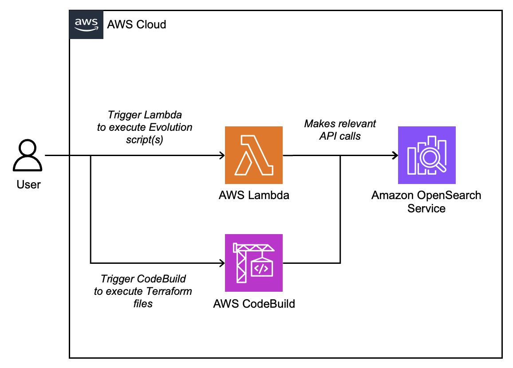

# Use CI/CD best practices to automate Amazon OpenSearch Service cluster management operations

This repository contains all the required code and configuration files required to run through the blog post example.

## Architecture

You will deploy the following architecture:



## Usage

### Pre-requisites

- Latest LTS versions of Python, Node, NPM, AWS CLI, AWS CDK, Java and Maven installed.
- An AWS account with the required role, permissions and credentials to deploy the stack.

### Build the solution
```bash
git clone <github url>
cd <git repo>
cd app/openSearchMigration
mvn package
cd ../../lambda_layer
chmox a+x create_layer.sh
./create_layer.sh
cd ../infra
npm install
npx cdk bootstrap
aws iam create-service-linked-role --aws-service-name es.amazonaws.com
npx cdk deploy --require-approval never
```

### Apply terraform files and trigger Evolution scripts

Please refer to the post for the remainder of the instructions.